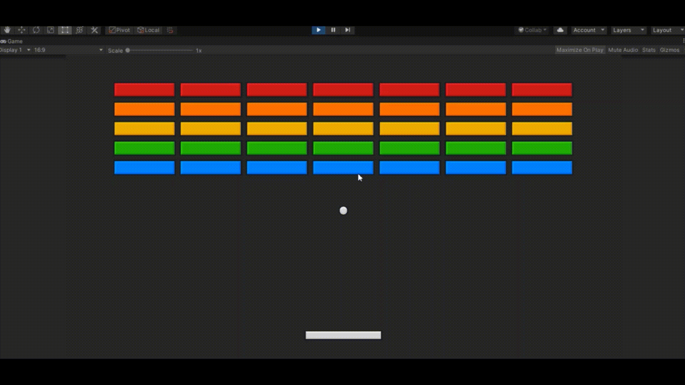

# Brick Breaker Project
 
Developed using the Unity Engine, this project is based of the age old classic 'Brick Breaker' arcade game. Using a paddle, the player hits a ball into a layer of blocks with the goal of destroying them all in the fastest time possible. The player completes the game by destroying all breaks in a level, and loses the game should they miss the ball and allow it fall beneath them.

### Gameplay

